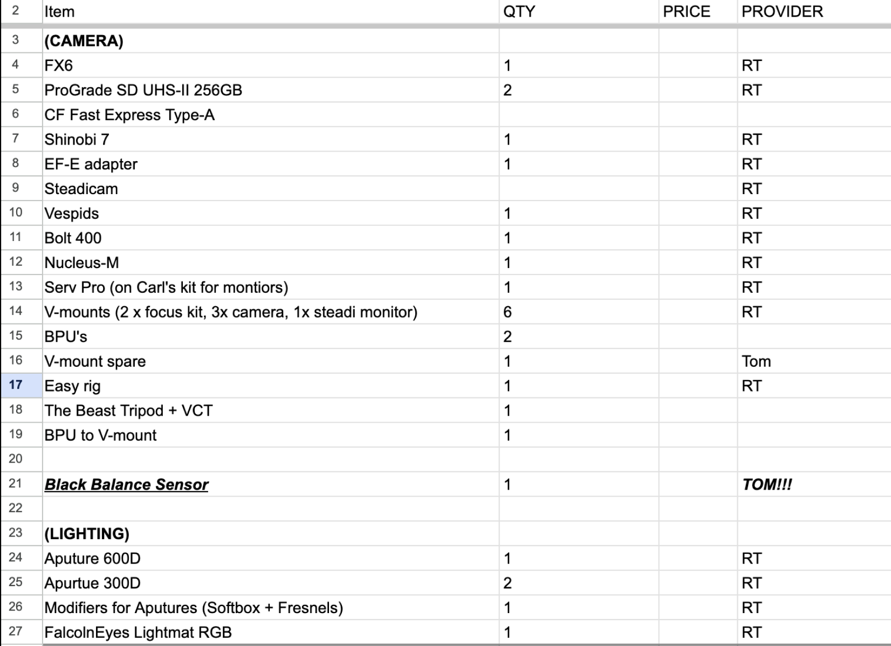
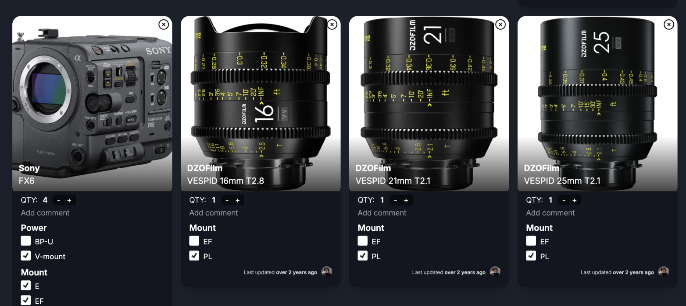
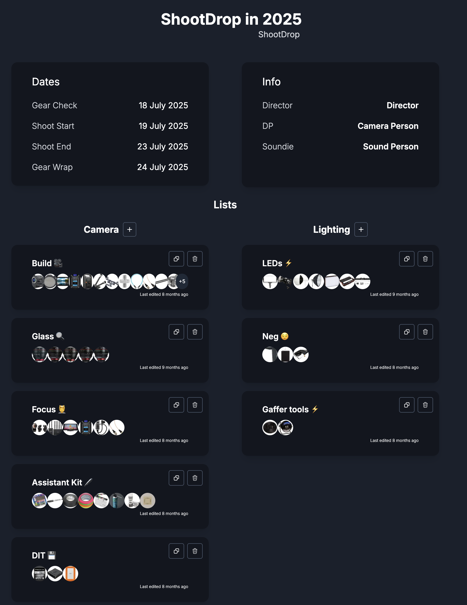
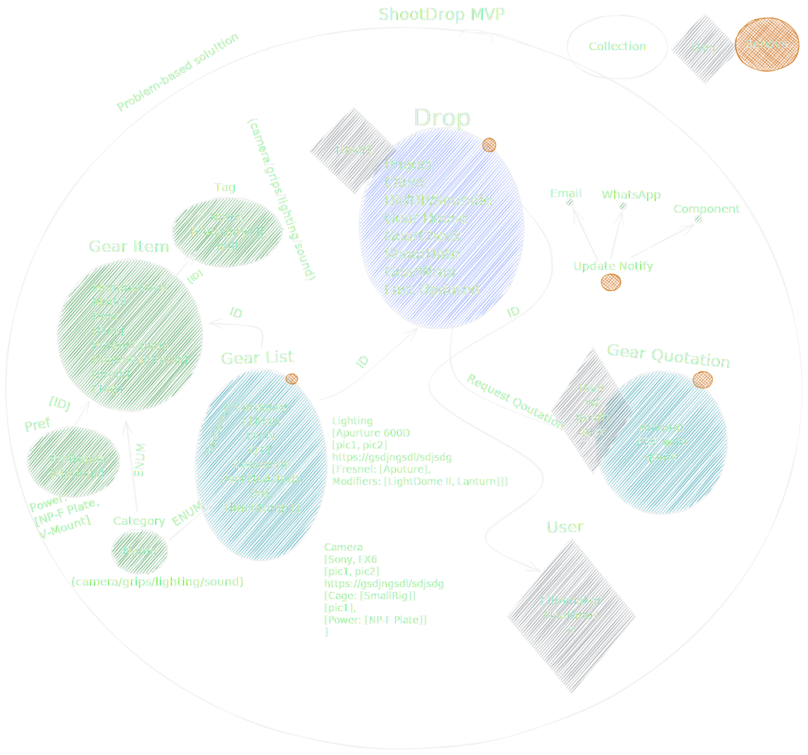
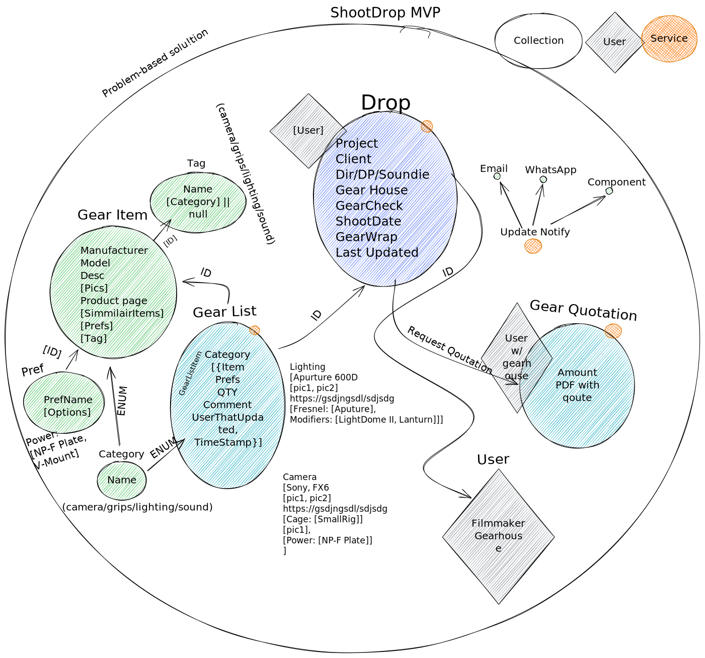
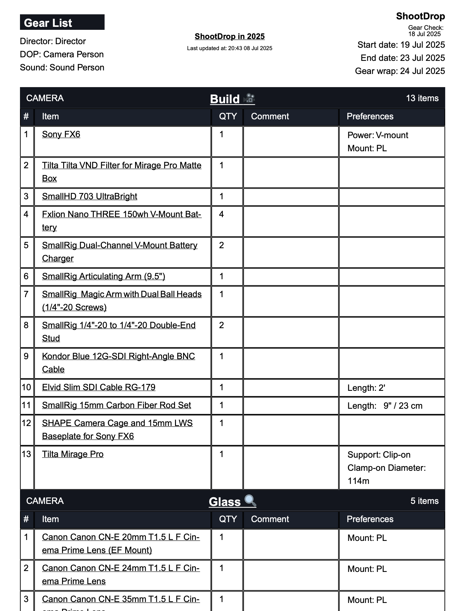

This bad boy is a tool for creating Gear Lists for film shoots.

DISCLAIMER, this write-up is a bit of a retrospective for me, I built this back in 2022 while moving out of the film industry and was absolutely frothing to solve this problem.
It 100% gave me the boost I needed as a builder. Before this project I had been spending years hacking together frameworks and CMS's to build stuff (RIP Drupal lol).
They never really allowed me to achieve my dreams and, to be honest, up to then I wasnt thinking in enough of a product mindset to even plan things well enough to build more complex tings.
I had built up some decent React/Node/Typescript skillz at this point but had never created something big and crazy from scratch - ie: just me and my imagination going wild.

## YOLO

Around the end of August 2022, after wrapping up what ended up being my last big film job, I decided to take a 3 month break from freelance work (both dev and film-making) and focus on shootdrop.
It was scary (because rent ya know?) but holyshit what banger of a life choice, no regrets.

Looking back, I was like "I can do this"... and damn did I do it.

## The problem

When I used to work on film shoots, during prep I always struggled with creating and collaborating on gear lists. It freaking sucked.

Im always advocating for very well defined problems, so I cooked up a comprehensive list of the problems I had:

Here's the _unchanged_ list of problems I jotted down in 2021:

**making gear lists is time-consuming**...

- it's hard to know all the available gear options
  - list & name them correctly
  - group them (grips/lighting/camera/sound)
  - tag them (Fixtures. Accessories. Textiles Stands.
    Cables. Stands. Silks. Frames.)
  - add on-item preferences
    (v-mount plate/eyepeice/X-OCN w/AXS-R7)
  - comment on items
    ("Needed for IR pollution on BMPCC")
  - know what simmilair items are
- it's hard to keep the list up to date
  - inform others of changes (email/whatsapp)
  - let collaborators (gaffer) add items
    - know who added what
  - let gear house acknowledge and qoute
- I dont want to think about set-up
  - it's all there and ready to go
  - no complex sign-up

This list got all of them wheels spinning and soon I had a pretty clear idea of what I **needed** to build.

## The market

Before cooking up code and sinking time into this bad boi. Who was I building this for?

Mostly me, which is cute to say but I was on my way out of the industry (sad 😢) so I needed a clear idea who was gonna use this thang.

Again, _unchanged_, see my plan:

WHO? --> DP's, Gaffers, AC's & ALL-IN-ONE FILMAKERS

HOW? --> DB of CHEAP, POPULAR GEAR (no arri yet)

WHERE --> IG = use userbase of DPs / film makers! Screen recordings to share.

WHERE --> LinkedIn (people on LI wont use it but they might be stoked to see!)

WHEN --> now, this thing is built! The more cheap gear the better, more attractive it gets!

THEN --> Interate slowly adding small improvements/features MVP baby!

## The tech

Me in 2022:

> I set out to implement this solution using NodeJS GraphQL API with a MongoDB database/AWS S3 and hooking into it with a NextJS web app complemented by TailwindCSS for rapid component styling along with Apollo Client for data fetching and state management.

As with anything in the JS ecosystem, this is cute to read today and I'm resisting doing a full re-write every day (to whatever the flavour of the day is at the time of reading). I knew NoSQL so I used NoSQL but damn would this thing have benefited from a SQL DB (maybe postgres + drizzle for the re-write 😈).

Another cute thing I wrote in 2022:

> Stoked to share that I'm ending the year with the MVP up and running! So far, we've had a number of filmmakers sign up and try it out since the launch over Instagram last week and I've been getting some awesome feedback on where improvements can be made... as well as some invaluable bug-crunching experience!

## Go check it out!

Sign up [here](https://shootdrop.com)!

This thing was a labour of love and really cemented the realisation that my core work passion lies in solving problems with software dev.
(a little more than it did with telling stories with camera's - although of course I do that for fun still!)

I went into software engineering full-time shortly after dropping this MVP of this puppy.

If you're still reading, thanks for giving this a squiz! It was quite the journey and really a great symbolism of my realisation that I'm much more of a sick dev then I am a film maker.
I sometimes stop by and add features and, hey, maybe the big re-write overhaul might be on the horizon soon ;)

hehe bye 👋
