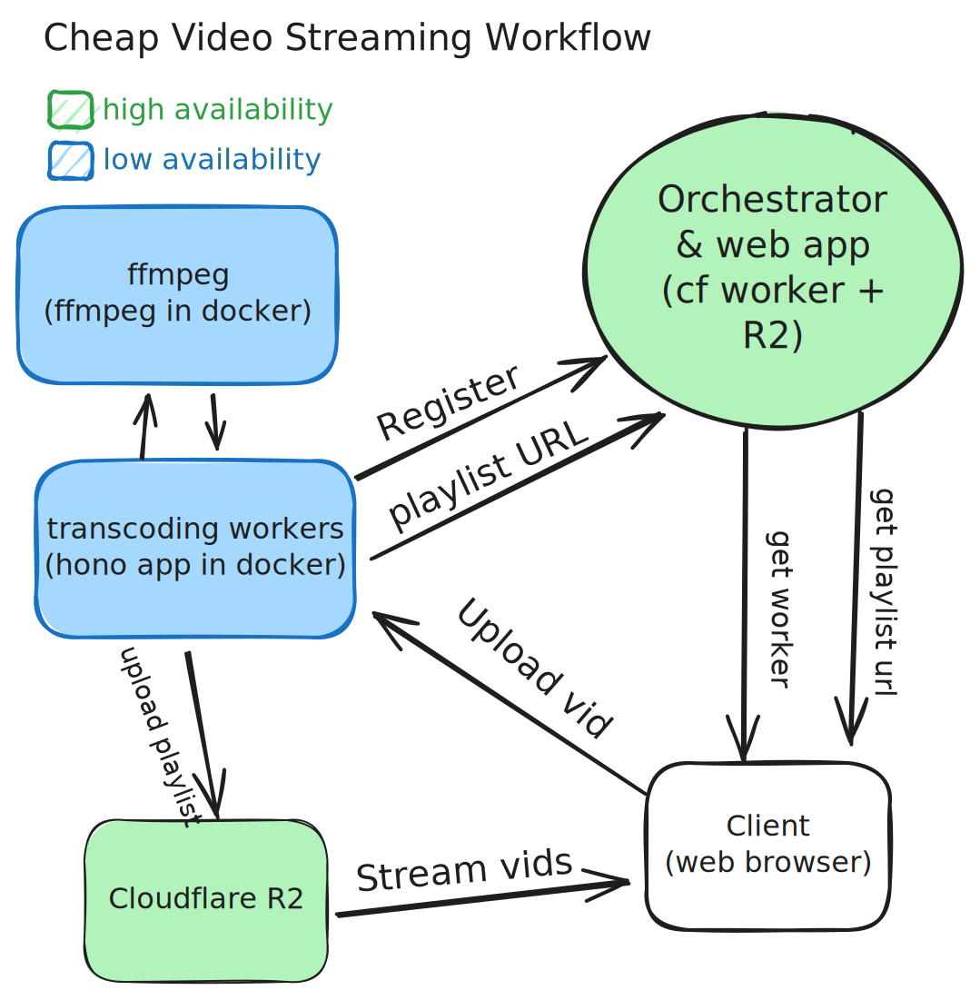
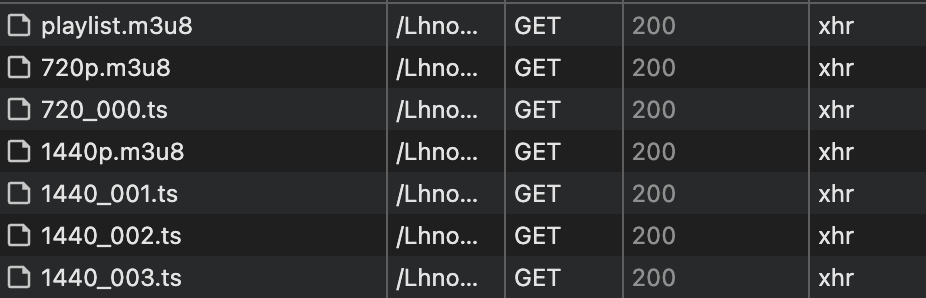
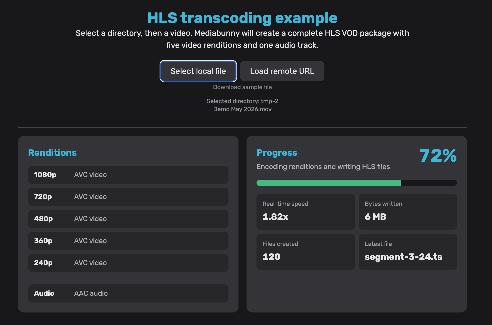

Steaming video is tough! 

## Why?

The key problem is this:

> Uploading a thicc video file directly and then letting your users play that bad boi via a simple `<video>` tag is a slow/bad experience.

"But Tom" you say, _"there are many many services that solve this already"_. 

To that I say:

- Paid services often cost more money than they're worth (I'm looking at you Vimeo 🤨)
- Free services like YouTube are untrustworthy (tracking yo users, adding banners, sneakying in a lil sneaky ad 🤭) - its a NO from me 😅 

You can use tool's like the `media-chome` web component to render a custom [youtube video player](https://www.media-chrome.org/docs/en/media-elements/youtube-video) but you still get the yucky Youtube UI under it.


## Streaming protocols

So how do these peeps make video chunk streaming possible? Enter the poorly named [HTTP Live Streaming protocol (HLS)](https://en.wikipedia.org/wiki/HTTP_Live_Streaming)... well suited for VOD (which aint "live" lol). 

It enables **adaptive** streaming - your users starts watching the vid ASAP (no matter the quality) and, based on their connection, chunks of different resolutions can get streamed in as they go - enabling a lekker smooth experience. There's a few other procotocols that do simmilair things like [DASH](https://en.wikipedia.org/wiki/Dynamic_Adaptive_Streaming_over_HTTP) (less popular but supports more codecs) and [WebRTC](https://en.wikipedia.org/wiki/WebRTC) (low-latency for live streaming). 

> HLS remains very [popular](https://www.mux.com/articles/hls-vs-dash-what-s-the-difference-between-the-video-streaming-protocols) for the VOD (video-on-demand) style of video streaming tho.

## Solution

I wondered how hard it would be to spin up my own sneaky Vimeo/Youtube/Mux alternative using HLS streams without breaking the BANK or the BRAIN 💆💸

Turns out... a little brain breaking - but IT WORKS BABAAY! 

Introducing [Streamgeek](https://github.com/TomRadford/streamgeek)! Have a look at a fun lil life vid I made and uploaded to my own streamgeek deployment:

<div class="aspect-4/3 overflow-hidden rounded-2xl">
    <iframe class="size-full" src="https://video.rad.gdn/embed/LhnowVeYP6S" title="XS-20 FTW 🔥" frameborder="0" allow="accelerometer; autoplay; clipboard-write; encrypted-media; gyroscope; picture-in-picture; web-share" referrerpolicy="strict-origin-when-cross-origin" allowfullscreen />
</div>


## The Idea

Video streams that meet user expectations by being fast and reliable are traditionally something web devs would outsource to a third-party service (often just by embedding Youtube 🤮). 

> Up to now, the excuse has been that rolling your own video hosting is "hard" or "expensive" - however I think that's not true in 2026 🤓

I built **streamgeek** as a POC so that you (yes you 🫵) can do this too. 

The main pillars I had for this solution were as follows:

1. highly available reliable adaptive videos served from a server in a close location: <br/> **Cloudflare R2 and their edge network** ✅
2. very customisable hls video player that looks and works good: <br/> media-chrome's **`hls-video-element`** ✅
3. less highly available uploading and generation of HLS playlists. I'm uploading WAY LESS then viewers would be streaming. If this dies sometimes it would be irritating but chill: <br/> **A lightweight [hono](https://hono.dev/) app in nodejs piping through commands to ffmpeg on my own hardware** ✅ 
4. tying everything together with a nice ui and embed links (so you can share anywhere): <br/> **rwsdk + hono + react + tailwind on cloudflare workers** ✅

<div className="hidden dark:block">
  
</div>

<div className="block dark:hidden">
  
</div>

Here's the upload flow in action:

<div class="aspect-4/3 overflow-hidden rounded-2xl">
    <iframe class="size-full" src="https://video.rad.gdn/embed/QZUWFxlOsIh" title="Streamgeek upload flow 🚀" frameborder="0" allow="accelerometer; autoplay; clipboard-write; encrypted-media; gyroscope; picture-in-picture; web-share" referrerpolicy="strict-origin-when-cross-origin" allowfullscreen />
</div>


##  Storage

Inspired by this [awesome article](https://screencasting.com/articles/cheap-video-hosting) by Screencasting.com - storing the hls video playlists on [Cloudflare R2](https://www.cloudflare.com/en-gb/developer-platform/products/r2/) means _free egress_ (yeah you heard that right dawg!) - you only pay for the amount of videos you store and not the bandwidth (ie: views) your videos get! 

>That's literally the main gotcha most of these paid services hit you with - bandwidth fees! <br/> If your site's vids get lots of traffic... RIP yo bank account 🪦

## Adaptive Video 

Adapting to different resolutions based on the user's available bandwidth with adaptive bitrate streaming.



### The anatomy of an HLS stream

[This](https://jazco.dev/2024/07/05/hls/) lovely article breaks it down in more detail but its basically:

- A bunch of `.ts` (transport stream) files - these are the video chunks of different resolutions (not typescript files hehe). 
- Each resolution has a `m3u8` media playlist that points to each of the corresponding resolutions's `ts` video chunks. 
- There's a master `m3u8` file, this serves as the entrypoint for the HLS stream - pointing to each of the different resolutions. Users will generally start at a lower bitrate and then bump up as a your speed is established.

Here's an example of what that master playlist looks like:

```txt
#EXTM3U
#EXT-X-VERSION:3
#EXT-X-STREAM-INF:BANDWIDTH=10000000,RESOLUTION=2160x1440
1440p.m3u8
#EXT-X-STREAM-INF:BANDWIDTH=8000000,RESOLUTION=1620x1080
1080p.m3u8
#EXT-X-STREAM-INF:BANDWIDTH=5000000,RESOLUTION=1080x720
720p.m3u8
#EXT-X-STREAM-INF:BANDWIDTH=2500000,RESOLUTION=720x480
480p.m3u8
#EXT-X-STREAM-INF:BANDWIDTH=1000000,RESOLUTION=540x360
360p.m3u8
```


### Sidebar: What about DASH?

DASH is a competing standard for streaming video - with wider codec support and more customisability. I ultimately opted to use HLS instead due to its broader adoption. Mux has a [great write up](https://www.mux.com/articles/hls-vs-dash-what-s-the-difference-between-the-video-streaming-protocols) on the pros and cons of each. So you're loosing out on VP9 codec support (Google's awesome codec for web video) but winning with simplicity. I'll probably looks into adding it at some point 🔍

## Encoding HLS (the hard bit 🌶️)

Being able to create these optimised HLS streams requires some horsepower. There are various ways about this... Some more attractive than others depending on how often you need post videos and (more importantly) how lazy or impatient you are.

### On your computer

In the past I've used a script like [this](https://gist.github.com/stenuto/9ff19ce89f07c7419a8d0976736ebe12) to spit out HLS playlists. This works but is quite a labour intensive process... I have to open a terminal, run the script, upload files and then reference the uploaded playlist manually - I'm too lazy for that shit 🫃 

### In the browser

While you could do this in the browser - its SLOW.

Trying `ffmpeg-wasm` was something I looked into early on. The ffmpeg.wasm [speed comparison](https://ffmpegwasm.netlify.app/docs/performance) shows a 0.04x slow down compared to ffmpeg on baremetal

> compiling ffmpeg to web-assembly makes it super damn slow and its viable 🐌

For client-side transcoding, there's now also [Mediabunny](https://mediabunny.dev/) which provides an awesome api around the [WebCodecs API](https://developer.mozilla.org/en-US/docs/Web/API/WebCodecs_API) and [canvas](https://developer.mozilla.org/en-US/docs/Web/API/Canvas_API) using hardware acceleration! Honestly, this is a freaking solid option since they added [HLS support](https://github.com/Vanilagy/mediabunny/releases/tag/v1.42.0) last month 🥳 



However, there's still a limitation here, not everyone has a nippy machine and client-side encoding of a video many times over at different resolutions is still gonna absolutely CHONK on many devices.

> I'm still very very keen to add mediabunny at some point tho, since its an awesome value proposition if you're ONLY gonna be uploading from a decent computer (and it would scope down deployment to just cloudflare workers instead of needing something to fun ffmpeg on - nice and simple!). Watch this space 🤓

### In the cloud

Expenny 💸

[AWS Elastic Transcoder](https://aws.amazon.com/elastictranscoder/), [Cloudflare Stream](https://www.cloudflare.com/products/cloudflare-stream/), [Mux](https://www.mux.com/) and various other services offer this to varying degrees of complexity and cost - but compute costs can blow out of proportion quite quickly.

And while something like Cloudflare containers suggests this as a [use case](https://blog.cloudflare.com/cloudflare-containers-coming-2025/#stateless-and-global-ffmpeg-everywhere), I didnt want to [blow a hole through my bank account](https://developers.cloudflare.com/containers/pricing/) by mistake. This [comparison](https://cloudcompare.xyz/) from cloudcompare.xyz further drives home these pricing concerns, highlighting gnarly scalable cloud compute costs for "serverless" containers compared to VPS hosting (ol' fashioned long running virtual servers).

> I do want to investigate cloudflare containers further though, would be sick to keep everything in the cf stack - allowing for much easier "one-click" deployments 😉 

### Something in between!

Since transcoding the videos doesn't need as much availability and scaling as the actual consumption of videos, spinning up an encoding server on **existing hardware** felt like the move 🤝 

With these two I have all I need to encode my vids.

- the **orchestrator**: cloudflare as the control plane
- the **transcoding agent**: ffmpeg on existing hardware: <br/> like my old Lenovo Thinkcentre, Gaming PC or literally my laptop!
- the **client**: your browser that uploads the vid straight to the agent. 


we opted to roll the following bespoke architecture:

--> Client hits the upload page  
--> Orchestrator points Client to Agent  
--> Direct file upload to Agent (public URL)  
--> Agent runs FFmpeg and make HLS playlist  
--> we upload HLS playlist and chunks to R2  
--> video upload done 💸

### Tech

The juicy bit! 

I could probably yap on a about this forever so I'm gonna take a bit of an alternative approach here and tell you to [clone the repo](https://github.com/TomRadford/streamgeek) have a poke around and ask your AI agent to explain how all the things work! (it'll do it better than me lol)

However, here is a short breakdown with my rational for each of the choices: 

#### The web app

- React with RSC using [rwsk](https://rwsdk.com/) (shoutout to Peter and Justin! 🇿🇦) 
- Tailwind
- 

- I use [tus-node-server](https://github.com/tus/tus-node-server?tab=readme-ov-file) to handle yeet 

##### Background Agent

### 4 - the ui

We

## Conclusion

This was a super fun endevour. As you can hopefully tell, coming from a video production background, I'm very passionate building stuff like this!

Absolutely stoked I got to share my learning with you - thanks for reading up to know homie. You're one of the real ones. 


## Further reading

- [Syntax Podcast Episode](https://syntax.fm/show/859/streaming-video-in-2025)
- [How HLS works](https://jazco.dev/2024/07/05/hls/)
- [Subatic story](https://subatic.com/story)
