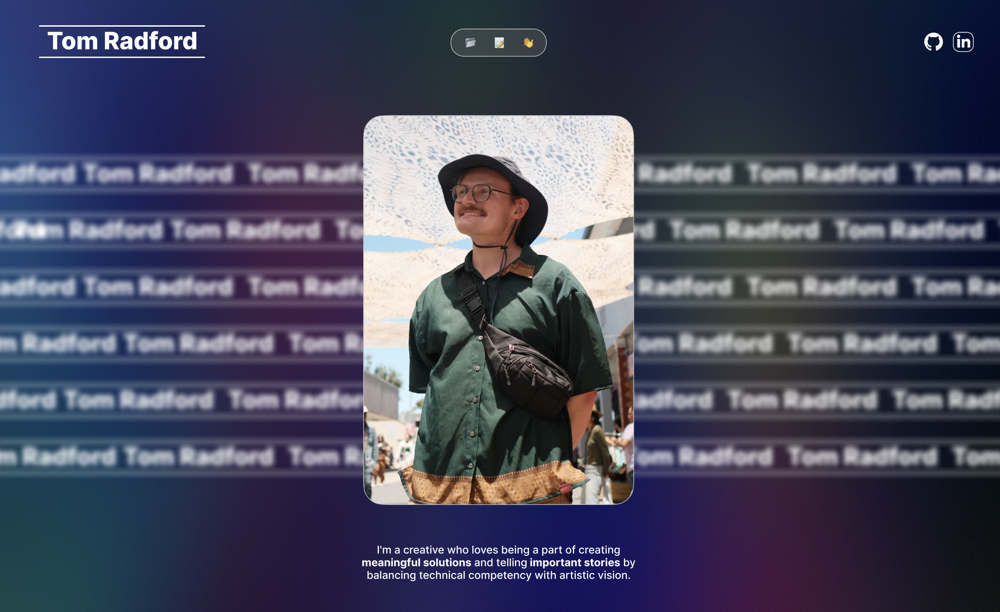
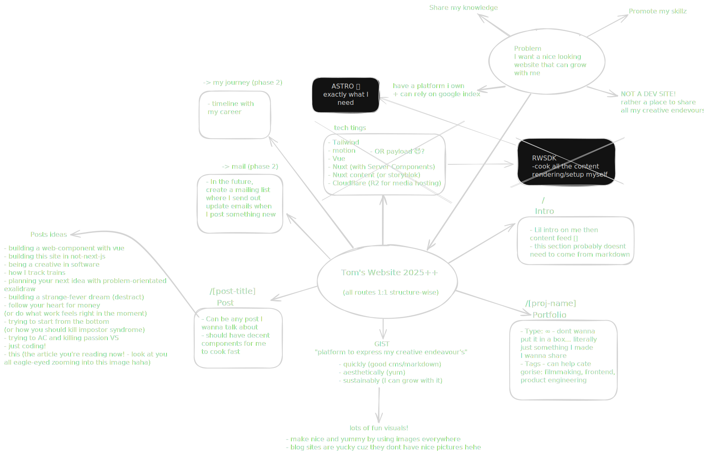
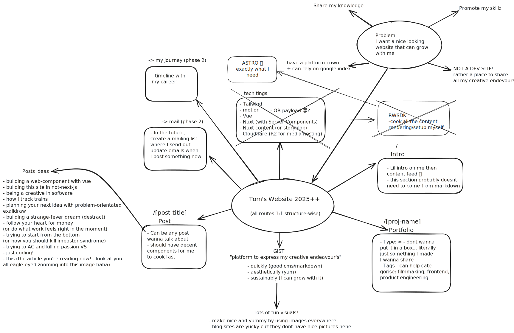
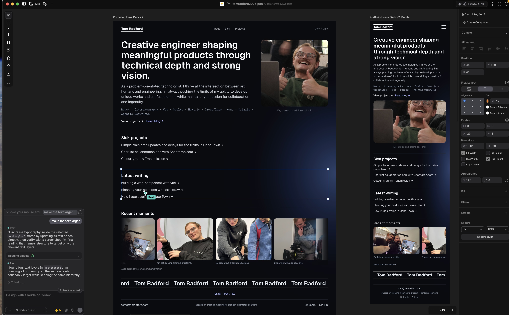
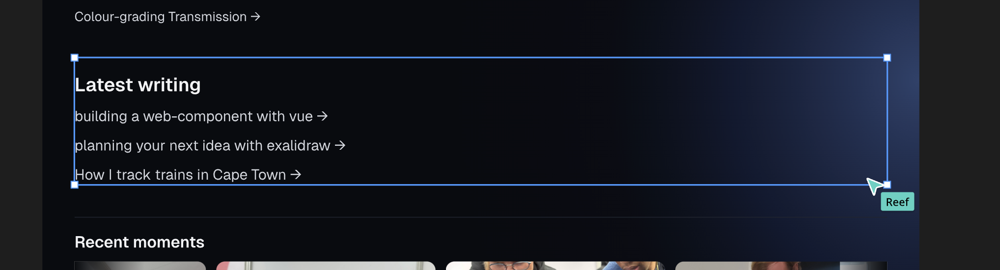

If you've worked with me, you know I'm always hyped to share my learnings. I've honestly been trying to cook up a platform like this since 2023.

Initially I had the classic "grand plan" of having a crazy GSAP-driven animation-heavy designers-fever-dream of a freaking website.
I had this mad idea of the ticker tape of my name speeding up and then my pic zooming in and having this whole sick-ass parrallex thing with all this cool shit popping in as you scroll.

But I had a problem in that I don't actually do that:

- I don't design for a living.
- I'm not a shaders/GSAP guy.
- Building crazy landing pages doesn't give me hype.

This made me have a realisation:

- I build awesome web applications for a living.
- I'm a user-driven application guy.
- Talking about web dev/product engineering gives me hype.

## Design

I didnt want to go overboard with some crazy design system. Rather I wanted something dead simple focussed on content and wasnt a random template.
With lots back and forward with agents in [Pencil](https://pencil.dev) and a bunch of manual tweaks, I got something absolutely perfect for what I need!

Not gonna lie, my intitial prompt took me some time to craft too, but honestly the speed at which I could get to a design I actually like was pretty shweet.

It felt like I was the co-pilot cooking with a very optimistic designer on figma. I have direction in well-crafted wording, and the agent klapped out design elements.

## Stack meandering

Brother let me tell you this made me my own worst enemy.

In 2024, when I was originally planning this, the idea was to cook up a nuxt site (mostly because I was playing with vue/nuxt and they time and I kinda loved it).

And then in 2025, I starting building basically astro from first principles using [RWSDK](https://rwsdk.com/) (mostly because I was building awesome little web apps with it!).

**Finally** in 2026, I realised that Astro solves everything for what I was effectively building: _a static old-skool website_, no fancy-JS, no DB, no streaming, literally just html and some tailwind (mostly 😋).

[Astro](https://astro.build) solves all my needs:

- Static site generation
- Image optimisation
- Being made literally for this sort of website so I can focus on writing articles!

Along with Astro, agents have been freaking great for implementing the design via Pencil's MCP server (again, with a lot of iteration and manual tweaking).

## AI slop free pledge

Hopefully you noticed that all the words on this site are hand-written by me, ya boi Tom.
I really want this to be a place where I can share my thoughts and findings - spelling mistakes and meme's included.

Hopefully see ya around soon!

Love ya bye! 👋
