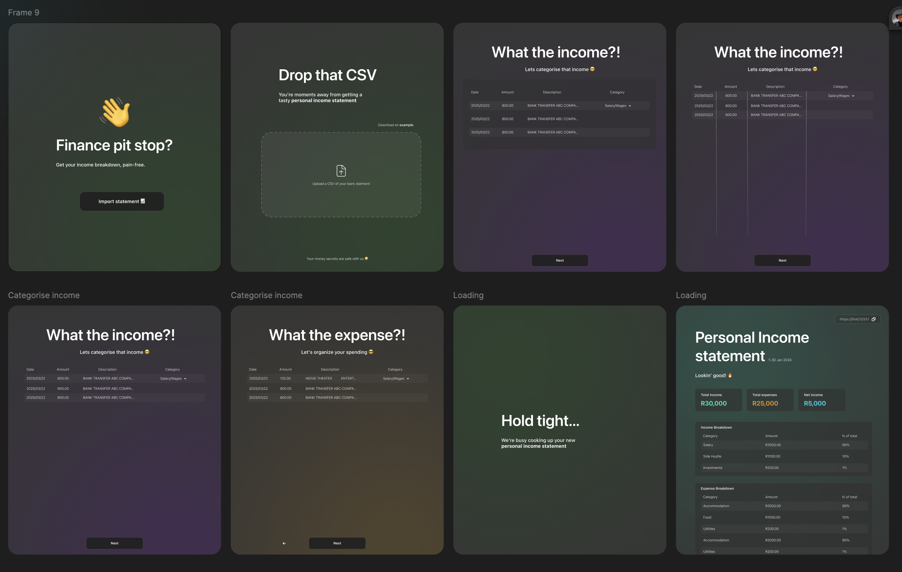

Sometimes you need to put a part of a website into another website.

I'm gonna call this a **widget**. Think something like:

- a support popup (Itercom)
- comment element (Disqus).
- anything else that enhances a website with low effort from the web dev.

Something that's:

- embeddable into other websites
- nicely consumable (ideally in a few lines of code)
- nicely configurable (ie: "props" that you could pass in like you would a React component)
- doesn't leak out of the website or allow the website to leak in (nicely scoped)
- framework agnostic (ie: I can gooi it in anything with relative ease)

## The problem

Traditionally, embedding these "widgets" on your site gets distributed by means of:

- yucky iframes (not very extensible)
- npm packages / script tags (suss, could inject some naught stuff into your site 🤨)
- framework-specific components (large support surface)

Non of these feel particularly great imo.

## Enter web components

A while back, after fighting with yet another yucky widget experience, I worm-holed a bit on if there was a better solution to shipping widgets.

Turns out **web components** are an absolutely GOATED solution for this use-case. They basically solution an answer for all of the above requirements! (scoped while still offering control).
As an experiment, I wanted to see how I could ship one! I wanted some nice familiar tooling.

## The problem

As an experiment, I wanted to build a **personal income statement generator** that anyone can embed in their site!



## Vue 🤝 web components

When I was playing with this idea in early 2025, I was learning [Vue](https://vuejs.org/) - mostly just out of curiousity to see how the DX stacked-up against my React and Svelte experiences.
I _really enjoying it_.

As a nice cowinkydink... turns out, the vue vite plugin has this gem:

```ts
   vue({
      template: {
        compilerOptions: {
          isCustomElement: (tag: string) => tag.includes("-"),
        },
      },
      customElement: true,
    }),
```

which allows use to bundle our vue app entrypoint as a freaking web component 🤯

## Show me the 💸

Yeah yeah.. you wanna see the thing... well here it is, embeded straight into this Astro website, have a play around!

<script type="module" src="https://flowvue.rad.gdn/dist/flow-vue.js"></script>

<flow-vue />

Cool hey!? (sorry about the pop-in, I havent quite got the SSR bit right on this)

## Tech

- The marketing site uses the `FlowVue` component directly (since we know we're already in a vue app with mostly the same deps)
- The web component bundles the `FlowVue` component into a `flow-vue` web component - which works as a mini-app and nicely seperates itself from the rest of the user's website.
